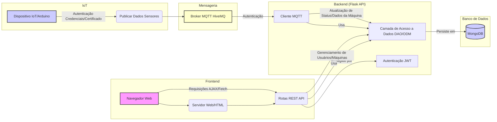
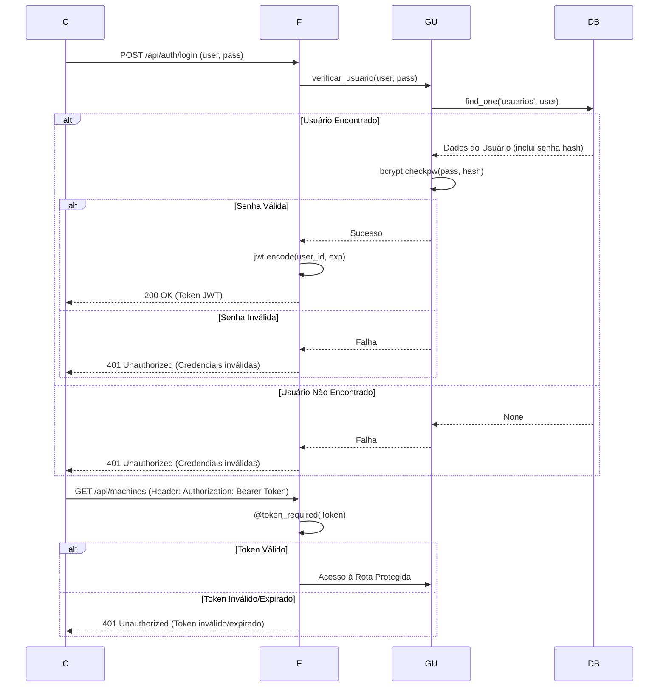
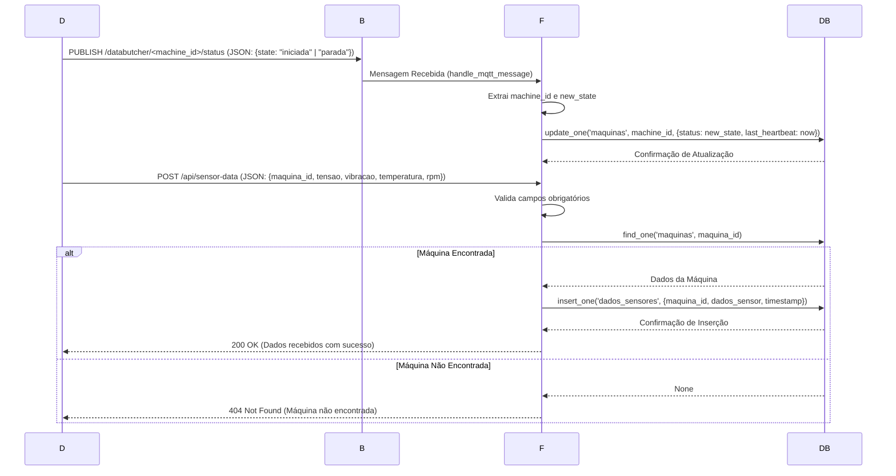

# Projeto DataButcher

O **DataButcher** é um projeto de monitoramento de máquinas industriais que combina um backend robusto em **Python (Flask)**, um banco de dados **MongoDB** e comunicação em tempo real via **MQTT** para coletar e gerenciar dados de sensores de dispositivos IoT (como um Arduino).

O objetivo principal é fornecer uma plataforma onde usuários possam registrar, associar e monitorar o status de suas máquinas, recebendo dados de telemetria (tensão, vibração, temperatura, RPM) e atualizações de status em tempo real.

## 🚀 Tecnologias Utilizadas

| Categoria | Tecnologia | Descrição |
| :--- | :--- | :--- |
| **Backend** | Python 3.x | Linguagem de programação principal. |
| **Framework Web** | Flask | Utilizado para construir a API REST e servir as páginas web. |
| **Banco de Dados** | MongoDB | Banco de dados NoSQL para armazenamento flexível de dados de usuários, máquinas e sensores. |
| **Mensageria** | MQTT | Protocolo leve de mensagens para comunicação em tempo real com dispositivos IoT. |
| **Broker MQTT** | HiveMQ (público) | Broker utilizado para o tráfego de mensagens entre dispositivos e o backend. |
| **Autenticação** | JWT (JSON Web Tokens) | Utilizado para proteger as rotas da API e gerenciar sessões de usuário. |
| **Segurança** | `bcrypt` | Utilizado para criptografar senhas de usuários antes de armazenar no banco de dados. |
| **IoT** | Arduino/Wokwi | Simulação de dispositivo IoT para envio de dados (código disponível na pasta `Arduino Wokwi`). |

## 🏗️ Arquitetura do Sistema

A arquitetura do DataButcher é dividida em três componentes principais: o **Frontend** (Web), o **Backend** (Flask API) e o **Sistema IoT** (Dispositivos e MQTT).

O diagrama a seguir ilustra a visão geral da arquitetura e o fluxo de comunicação entre os componentes:



## 🔒 Fluxo de Autenticação

O sistema utiliza um fluxo de autenticação baseado em **JSON Web Tokens (JWT)** para proteger as rotas sensíveis da API.

1.  O usuário envia suas credenciais para o endpoint de login.
2.  O sistema verifica as credenciais no MongoDB, utilizando `bcrypt` para a checagem segura da senha.
3.  Em caso de sucesso, um JWT é gerado, contendo o `user_id` e a data de expiração.
4.  O token é retornado ao cliente, que deve incluí-lo no cabeçalho `Authorization: Bearer <token>` em todas as requisições subsequentes às rotas protegidas.



## ⚙️ Fluxo de Dados IoT (MQTT e API REST)

O projeto utiliza dois canais principais para receber dados dos dispositivos IoT:

1.  **MQTT para Status em Tempo Real:** Usado para atualizações de status de máquina (`iniciada` ou `parada`). O backend atua como um cliente MQTT, se inscreve nos tópicos e atualiza o status da máquina no MongoDB.
2.  **API REST para Dados de Sensores:** Usado para enviar dados de telemetria (tensão, vibração, temperatura, RPM) para o endpoint `/api/sensor-data`.

### Detalhe do Fluxo de Dados IoT



## 📂 Estrutura do Projeto

O projeto está organizado da seguinte forma:

```
Projeto_DataButcher/
├── Arduino Wokwi/           # Código de simulação do dispositivo IoT (Arduino)
│   ├── diagram.json
│   ├── libraries.txt
│   ├── sketch.ino           # Lógica do sensor e comunicação MQTT
│   └── wokwi-project.txt
├── MongoDB/                 # Módulos de gerenciamento do banco de dados
│   ├── __init__.py
│   ├── gerencia_BD.py       # Funções CRUD básicas para MongoDB
│   ├── gerencia_maquinas.py # Lógica de associação e listagem de máquinas
│   └── gerencia_usuario.py  # Lógica de cadastro e autenticação de usuários (bcrypt)
├── Qrcode/                  # Pasta para armazenar QR Codes gerados
│   └── qrcode_...png
├── templates/               # Arquivos HTML do frontend (Flask)
│   ├── TelaInicial.html
│   └── machines.html
├── app.py                   # Aplicação Flask principal (API REST e Cliente MQTT)
├── main.py                  # Aplicação de console para testes e cadastro inicial de máquinas
└── README.md                # Este arquivo
```

## 🛠️ Configuração e Execução

### Pré-requisitos

*   Python 3.x
*   MongoDB Atlas URI (ou instância local)
*   Variáveis de ambiente configuradas

### 1. Variáveis de Ambiente

Crie um arquivo `.env` na raiz do projeto com as seguintes variáveis:

```dotenv
# Credenciais do MongoDB
MONGO_USER="seu_usuario_mongo"
MONGO_PASS="sua_senha_mongo"
DB_NAME="DataButcherDB"

# Chaves Secretas para Flask e JWT
SECRET_KEY="sua_chave_secreta_flask"
JWT_SECRET_KEY="sua_chave_secreta_jwt"
```

### 2. Instalação de Dependências

Instale as bibliotecas Python necessárias:

```bash
pip install Flask flask-cors pymongo python-dotenv paho-mqtt flask-mqtt pyjwt bcrypt qrcode
```

### 3. Execução

O projeto pode ser executado de duas formas:

#### A) Aplicação de Console (`main.py`)

Ideal para cadastrar usuários e máquinas iniciais, além de testar a lógica de gerenciamento de forma isolada.

```bash
python main.py
```

#### B) Aplicação Web/API (`app.py`)

Inicia o servidor Flask, a API REST e o cliente MQTT para comunicação em tempo real.

```bash
python app.py
```

O servidor estará disponível em `http://127.0.0.1:5000/`.

## 📝 Rotas da API (Flask)

| Método | Rota | Descrição | Proteção |
| :--- | :--- | :--- | :--- |
| `GET` | `/api/health` | Verifica a saúde da API. | Nenhuma |
| `POST` | `/api/auth/register` | Cadastra um novo usuário. | Nenhuma |
| `POST` | `/api/auth/login` | Realiza o login e retorna um JWT. | Nenhuma |
| `POST` | `/api/machines` | Associa uma máquina existente ao usuário logado. | JWT |
| `GET` | `/api/machines` | Lista todas as máquinas associadas ao usuário logado. | JWT |
| `DELETE` | `/api/machines/<id>` | Remove a associação de uma máquina. | JWT |
| `POST` | `/api/sensor-data` | Recebe dados de telemetria dos dispositivos IoT. | Nenhuma |
| `GET` | `/` | Página inicial (HTML). | Nenhuma |
| `GET` | `/machines` | Página de visualização de máquinas (HTML). | Nenhuma |
